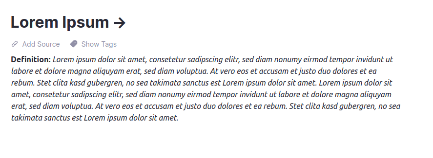

# Flashcard from headline to body

Moves Flashcard from headline to body

## Usage

Problem: Currently the whole flashcard (front- and backtext) are displayed in the headline when you are looking at the detail rem view. Like in Picture 1. 
this is a bit messy.

Solution: The plugin will render the backtext of the flashcard directly under the headline in a smaller font. Like in Picture 2.

What you need to do?: You simply need to install the plugin and activate it.

### Picture 1: Before plugin activation

### Picture 2: After plugin activation

